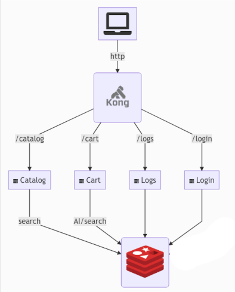
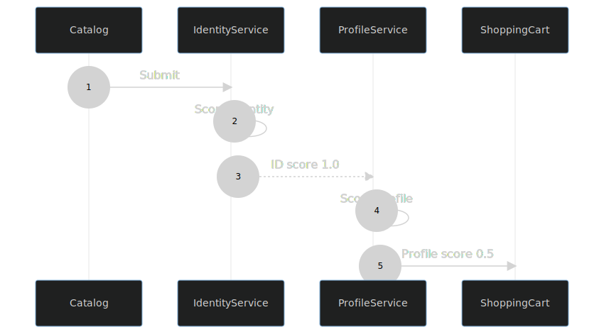

## Anti-Fraud with Redis

---

## Goals

- Minimize detection time

- Stop fraud as early as possible in the process

- Layer the approach for maximum efficiency 

- Only run computationally expensive calculations when absolutely necessary

---

## Flow

---

## Fraud Score

| | |
|--|--|
|Identity|Confirm the user characteristics|
|Profile|Confirm the user behavior|
|AI|Score overall purchase patterns|
| | | 

---

## Architecture

---

## Architecture

|Component|Usage|
|--|--|
|Redis Search | Catalog and Shopping Cart |
|Redis Bloom | User purchase profiles |
|Redis AI | Cart scoring |
|||

---

## Services - Identity

 

- Check user session (cookie)
- Check user IP address 
- Check user Browser fingerprint
- Score Identity 0.0-1.0

---

## Services - Profile

### Redis Bloom
 

- purchased from this category before?
- purchase from category and level before?
- Score Profile 0.0-1.0

---

## Services - AI

### Redis AI
 

- Market Basket Analysis
- to be avoided if possible
- Score AI 0.0-1.0

---

## Scoring

<small>

- Each stage checks the cumulative score
- If it exceeds 1.5 we consider it safe and proceed
- Unsafe scores in the cart require further action

</small>

---

## Services - Cart

### Redis Search
 

- stored in search by session
- rescore can be triggered

---

---

---

---

## Demo

Watch the fraud score!!