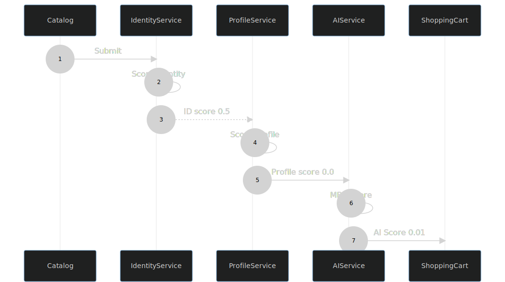

## Anti-Fraud with Redis

---

## Goals

- Stop fraud as early as possible in the process

- Layer the approach for maximum efficiency 

- Only run computationally expensive calculations when absolutely necessary

- Use event sourcing and microservices for ease of update

---

## Flow

---

## Fraud Score

| | |
|--|--|
|Identity|Confirm the user characteristics|
|Profile|Confirm the user behavior|
|AI|Score overall purchase patterns|
| | | 

---

## Architecture

---

## Architecture

|Component|Usage|
|--|--|
|Redis Streams | Message bus |
|Redis Gears | Event processing |
|Redis Search | Catalog and Shopping Cart |
|Redis Bloom | User purchase profiles |
|Redis AI | Cart scoring |
|||

---

## Services - Identity

### Redis Gear
 

- Check user session (cookie)
- Check user IP address 
- Check user Browser fingerprint
- Score Identity 0.0-1.0

---

## Services - Profile

### Redis Gear/Bloom
 

- purchased from this category before?
- purchase from category and level before?
- Score Profile 0.0-1.0

---

## Services - AI

### Redis Gear/AI
 

- basket comparison
- to be avoided if possible
- Score AI 0.0-1.0

---

## Services - Cart

### Redis Gear
 

- store in search
- rescore can be triggered
- other services use gear to display information

---

---

---

---

## Demo

Watch the fraud score!!